# Projet Unit Test TP - Gestionnaire de Tâches (To-Do List)

## Introduction

Ce projet est une implémentation d'une mini application de gestion d'utilisateurs avec des tests unitaires. L'objectif est de démontrer les bonnes pratiques de tests en PHP, en particulier avec PHPUnit.

## Tests unitaires

Les tests unitaires sont implémentés dans la classe `UserManagerTest` qui étend `\PHPUnit\Framework\TestCase`. Voici les tests réalisés :

### 1. `testAddUser()`
Ce test vérifie que la méthode `addUser()` ajoute correctement un utilisateur à la base de données, et vérifie qu'il puisse être récupéré. L'utilisateur est ensuite supprimé pour nettoyer la base de données, en préparation des autres tests.

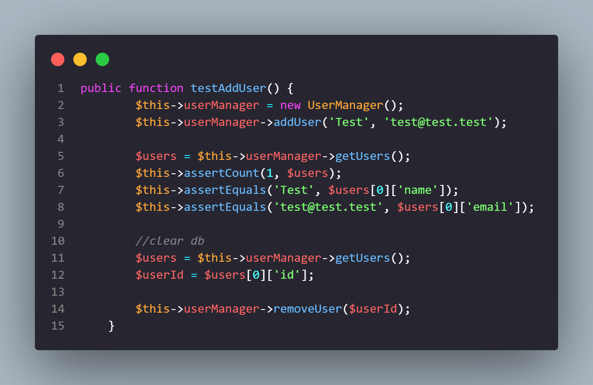

### 2. `testAddUserEmailException()`
Ce test vérifie que la méthode `addUser()` renvoie correctement une exception `InvalideArgumentException` quand un utilisateur avec un email invalide est ajouté à la base de données.

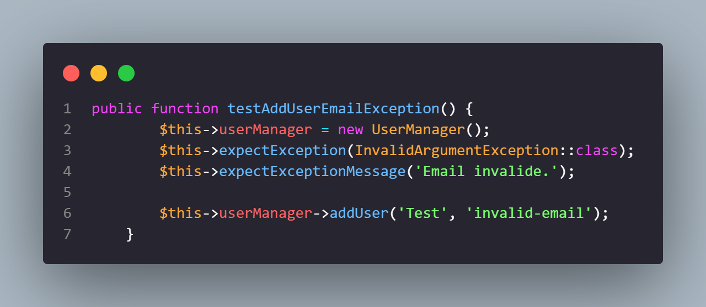

### 3. `testUpdateUser()`
Ce test vérifie que la méthode `updateUser()` modifie correctement un utilisateur de la base de données. L'utilisateur est ensuite supprimé pour nettoyer la base de données, en préparation des autres tests.

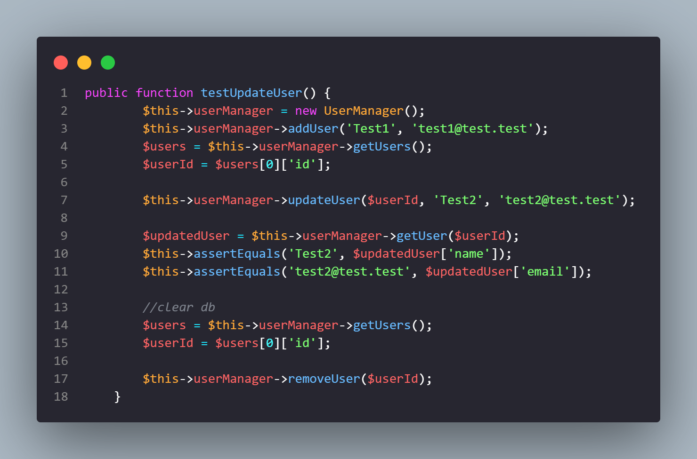

### 4. `testRemoveUser()`
Ce test vérifie que la méthode `removeUser()` supprime correctement un utilisateur de la base de données.

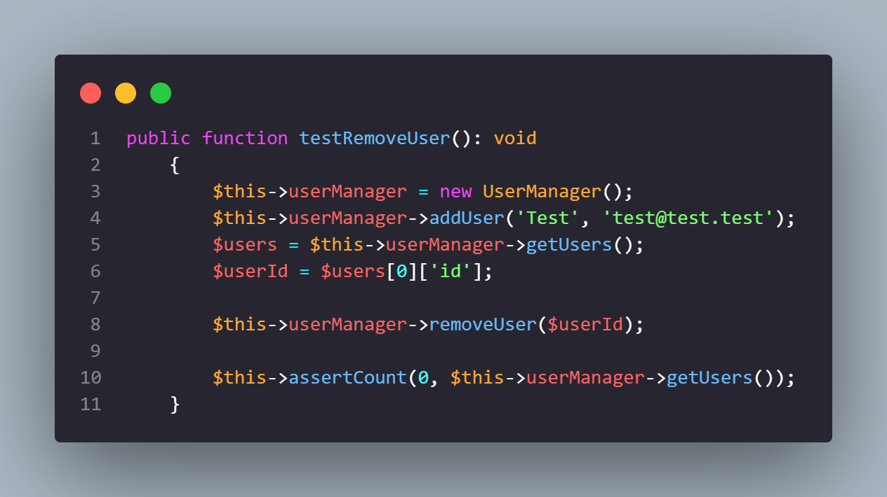

### 5. `testGetUsers()`
Ce test vérifie que la méthode `getUsers()` supprime correctement un utilisateur de la base de données.

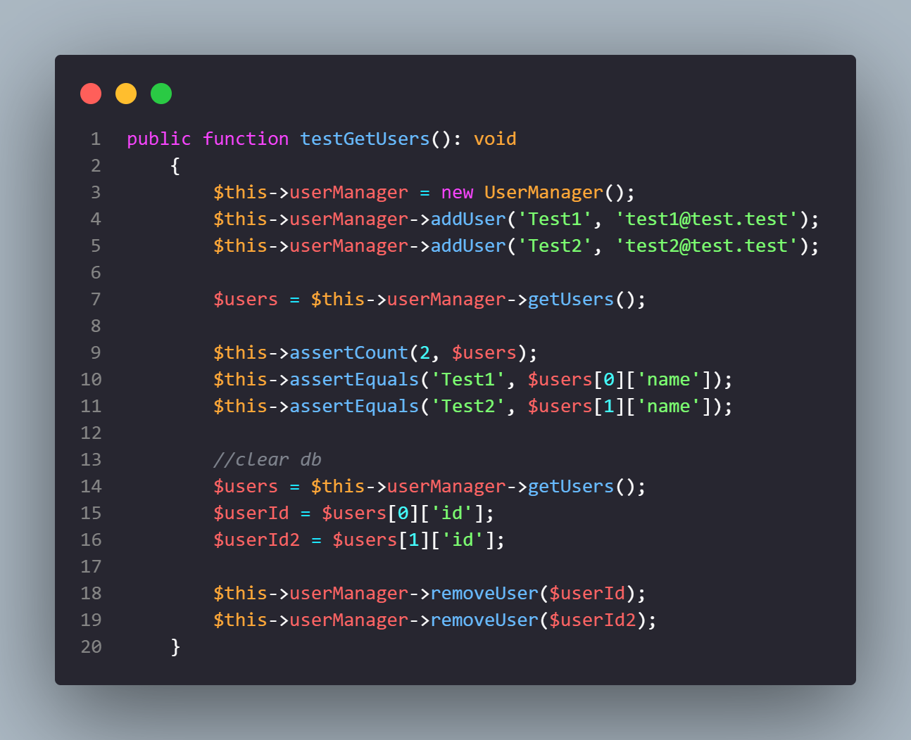

### 6. `testInvalidUpdateThrowsException()`
Ce test vérifie que la méthode `updateUser()` renvoie bien une `Exception` quand l'utilisateur modifié n'existe pas.

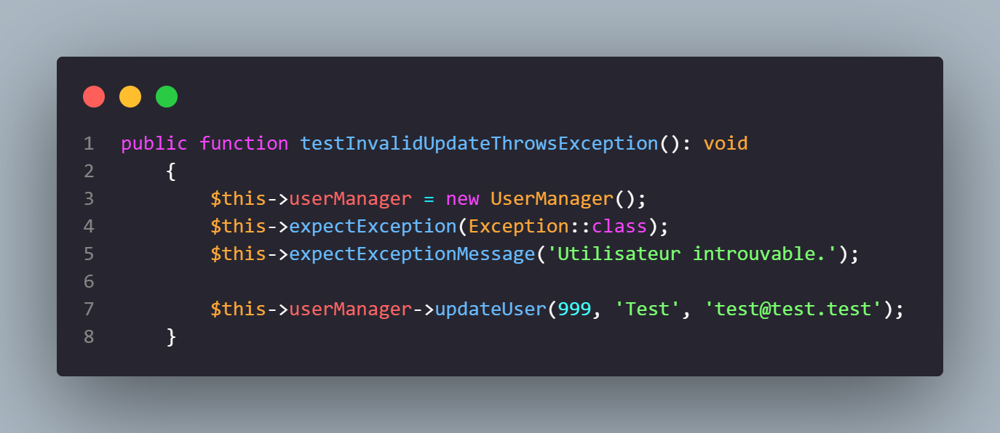

### 7. `testInvalidDeleteThrowsException()`
Ce test vérifie que la méthode `removeUser()` renvoie bien une `Exception` quand l'utilisateur supprimé n'existe pas.

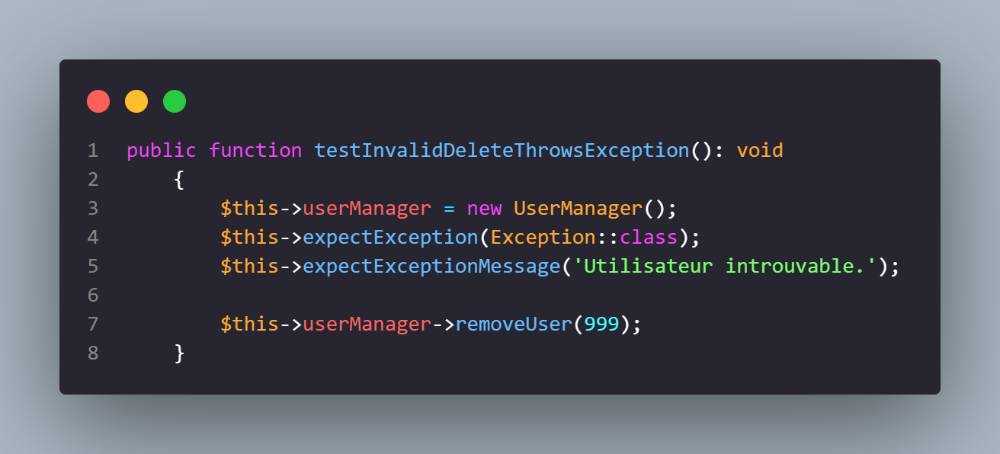

## Résultats des Tests

### 2.1. Tests Fonctionnels (PHPUnit)

| Test | Description | Résultat |
|------|-------------|----------|
| testAddUser() | Vérification de l'ajout d'un utilisateur | Succès |
| testAddUserEmailException() | Vérification du lancement d'exception lors d'un ajout d'utilisateur avec mauvaise email | Succès |
| testUpdateUser() | Vérification de la modification d'un utilisateur | Succès |
| testRemoveUser() | Vérification de la suppression d'un utilisateur | Succès |
| testGetUsers() | Vérification de la récupération des utilisateurs | Succès |
| testInvalidUpdateThrowsException() | Vérification du lancement d'exception lors de la modification d'un utilisateur | Échec |
| testInvalidDeleteThrowsException() | Vérification du lancement d'exception lors de la suppression d'un utilisateur | Échec |

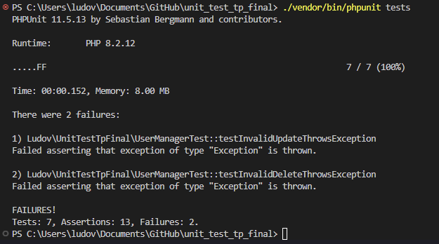

### 2.2. Tests End-to-End (E2E) avec Selenium et Cypress

Pour les tests E2E, j'ai utilisé Selenium pour simuler les interactions utilisateur avec l'application.
Avant toute chose, j'ai dû modifier la partie JavaScript du projet, afin d'ajouter une balise span pour entourer le nom et email des utilisateurs dans la liste, afin de pouvoir récupérer la valeur exacte sans avoir les boutons de l'élément.

#### Scénario de test 1

Le scénario de test suivant a été exécuté :
1. Ouvrir la page
2. Définir la taille de la fenêtre
3. Cliquer sur la textbox du nom
4. Écrire la valeur "test"
5. Cliquer sur la textbox de l'email
6. Écrire la valeur "test@test.test"
7. Cliquer sur le bouton ajouter
8. Vérifier que l'élément de la liste est présent
9. Vérifier que la valeur de cet élément est bien "test (test@test.test)"

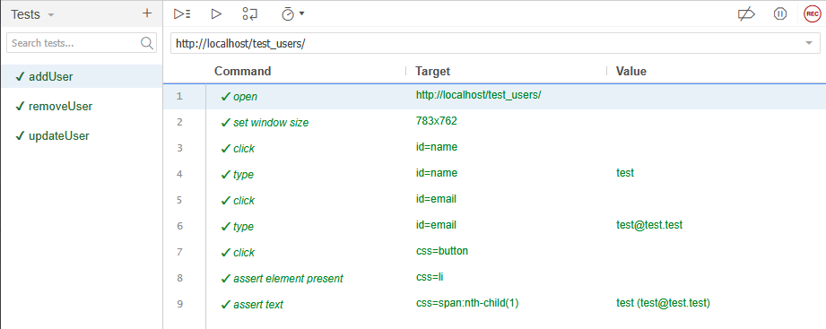

#### Résultats des tests E2E 1

| Étape | Action | Résultat |
|-------|--------|----------|
| 1 | Ouvrir la page | Succès |
| 2 | Définir la taille de la fenêtre | Succès |
| 3 | Cliquer sur la textbox du nom | Succès |
| 4 | Écrire la valeur "test" | Succès |
| 5 | Cliquer sur la textbox de l'email | Succès |
| 6 | Écrire la valeur "test@test.test" | Succès |
| 7 | Cliquer sur le bouton ajouter | Succès |
| 8 | Vérifier que l'élément de la liste est présent | Succès |
| 9 | Vérifier que la valeur de cet élément est bien "test (test@test.test)" | Succès |


#### Scénario de test 2

Le scénario de test suivant a été exécuté :  
1. Ouvrir la page  
2. Définir la taille de la fenêtre  
3. Cliquer sur le bouton de suppression 
4. Vérifier que l’élément de la liste n’est plus présent  

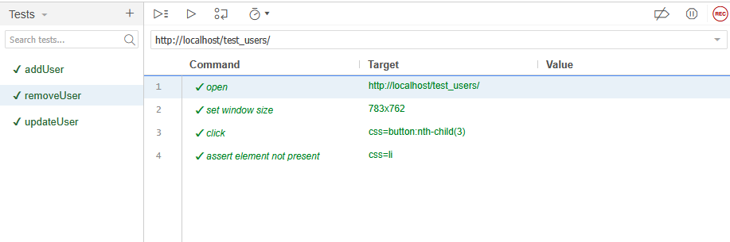

#### Résultats des tests E2E 2

| Étape | Action | Résultat |
|-------|--------|----------|
| 1 | Ouvrir la page | Succès |
| 2 | Définir la taille de la fenêtre | Succès |
| 3 | Cliquer sur le bouton de suppression | Succès |
| 4 | Vérifier que l’élément de la liste n’est plus présent | Succès |

#### Scénario de test 3

Le scénario de test suivant a été exécuté :
1. Ouvrir la page
2. Définir la taille de la fenêtre
3. Cliquer sur la textbox du nom
4. Écrire la valeur "test"
5. Cliquer sur la textbox de l'email
6. Écrire la valeur "test@test.test"
7. Cliquer sur le bouton ajouter
8. Cliquer sur le bouton modifier
9. Cliquer sur la textbox de l'email
10. Changer la valeur pour "test2@test.test"
11. Cliquer sur le bouton ajouter
12. Vérifier que la valeur de cet élément est bien "test (test2@test.test)"


#### Résultats des tests E2E 3

| Étape | Action | Résultat |
|-------|--------|----------|
| 1 | Ouvrir la page | Succès |
| 2 | Définir la taille de la fenêtre | Succès |
| 3 | Cliquer sur la textbox du nom | Succès |
| 4 | Écrire la valeur "test" | Succès |
| 5 | Cliquer sur la textbox de l'email | Succès |
| 6 | Écrire la valeur "test@test.test" | Succès |
| 7 | Cliquer sur le bouton ajouter | Succès |
| 8 | Cliquer sur le bouton modifier | Succès |
| 9 | Cliquer sur la textbox de l'email | Succès |
| 10 | Changer la valeur pour "test2@test.test" | Succès |
| 11 | Cliquer sur le bouton ajouter | Succès |
| 12 | Vérifier que la valeur de cet élément est bien "test (test2@test.test)" | Succès |


Tous les tests E2E ont été exécutés avec succès, confirmant que l'extension web fonctionne correctement pour les opérations d'ajout, suppression et modification d'utilisateur.


### 2.3. Tests de Non-Régression

Pour assurer que les nouvelles modifications n'introduisent pas de régressions dans l'application, j'ai effectué des tests de non-régression en comparant le comportement avant et après les modifications.

#### Modifications apportées au code

J'ai ajouté un rôle pour les utilisateurs, les modifications précises sont les suivantes : 
- Ajout d'un champ "Rôle" à la création de l'utilisateur
- Ajout de l'affichage du rôle
- Modification de la BDD pour ajouter une nouvelle colonne
- Modification des méthodes POST et PUT dans les fichiers .js et .php afin de bien inscrire le role

#### Résultats des tests de non-régression

Une fois les modifications apportées au code, je remarque que deux des trois tests ne sont plus validés.

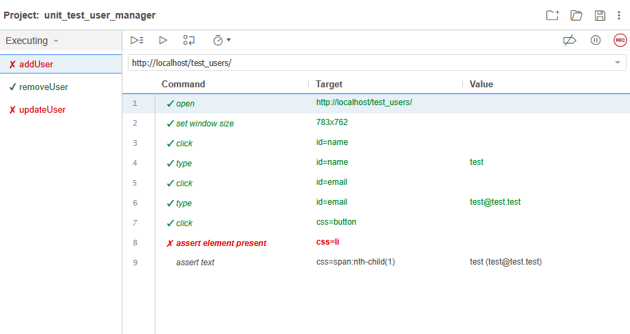  
Ici, le test n'est pas validé car il ne trouve pas l'élément correspondant à l'utilisateur dans la liste.  
**Pourquoi ?**  
Lors de la création de l'utilisateur, le test ne rajoute pas le role de ce dernier, ce qui empêche la création.

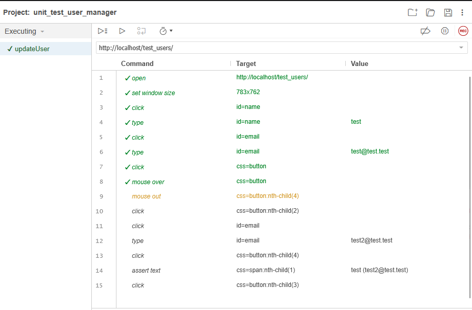
Ici, le test n'est pas validé car il ne trouve pas le bouton pour modifier l'utilisateur dans la liste.  
**Pourquoi ?**  
Lors de la création de l'utilisateur, le test ne rajoute pas le role de ce dernier, ce qui empêche la création.

#### Analyse des résultats

Grâce à ces résultats, je constate que l'ajout de cette nouveauté a créé de la régression, ce qui montre que l'ajout peut être mieux réalisé. Une amélioration possible serait de mettre une valeur par défaut pour le rôle, ou bien une valeur que l'utilisateur ne peux pas choisir.

### Tests Cypress

Les tests cypress ont été effectués, cependant je n'arrive pas à les faire valider pour une raison parfaitement inconnue.  
Ils devraient en théorie fonctionner de la manière suivante : 
- Création utilisateur
- Modification utilisateur
- Suppression utilisateur


### 2.4. Tests de Performance avec JMeter

Les tests de performance avec JMeter sont disponibles dans le dossier tests/JMeter.jmx  
Le site semble ne pas supporter la charge


#### Analyse des performances

Il m'est difficile de faire une analyse de performances avec le graph suivant :
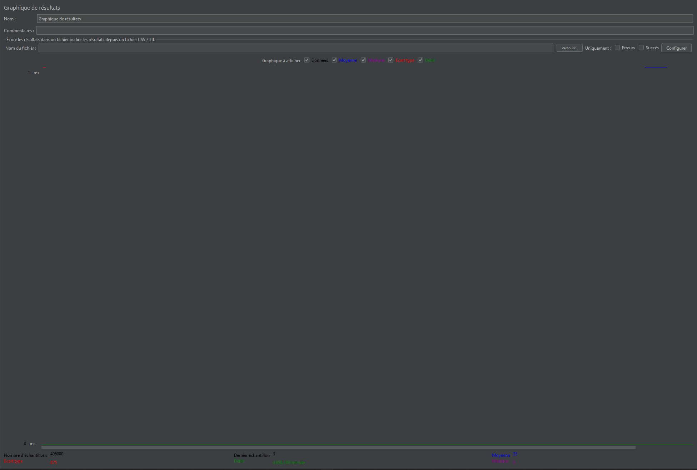

#### Propositions d'améliorations


## Comment exécuter les tests

### Tests unitaires

Pour exécuter les tests unitaires, utilisez la commande suivante à la racine du projet :

```bash
./vendor/bin/phpunit tests
```

## 3. Problèmes détectés et solutions proposées

Au cours du projet, j'ai rencontré différents soucis avec le site. 

- Les éléments de la liste avec le nom de l'utilisateurs n'étaient pas correctement séparés, ce qui compliquait beaucoup la récupération des informations de l'utilisateur. Pour palier à ce problème, j'ai ajouté une balise span autour du nom de l'utilisateur, pour facilité sa récupération.

## 4. Conclusion

Pour conclure, les tests unitaires via phpUnit sont efficaces, et permettent de correctement tester l'application actuellement. Ils demanderont cependant des mises à jour si de nouvelles fonctionnalités sont ajoutées.
Les tests de régression permettent aussi de correctement tester l'appli, et se sont montrés utiles lors de l'ajout d'une nouvelle fonctionnalité.
Cependant, je n'ai pas réussi à faire fonctionner les tests Cypress ainsi que les tests de performance JMeter, pour des raisons qui m'échappent. Faire fonctionner ces tests sera un gros axe d'amélioration.


Réalisé par : Ludovic MARIE
Date : 07/04/2025